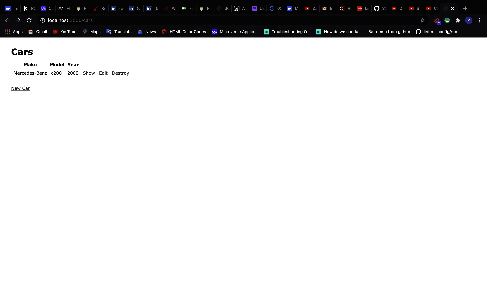

# Cars App

This is a sample Rails app done as per the Odin project instructions to get familiar with setting up and working with Ruby on Rails.

## Built With

- Rails 5.2.4.4
- SQLite3

## Authors

👤 **Paul Balitema Kabali**

- Github: [@pbkabali](https://github.com/pbkabali)
- Twitter: [@pbkabali](https://twitter.com/pbkabali)
- Linkedin: [engineerbpk](https://linkedin.com/in/engineerbpk)

## Acknowledgments

- [The Odin Project](https://www.theodinproject.com/)

## 📝 License

This project is [MIT](https://opensource.org/licenses/MIT) licensed.
